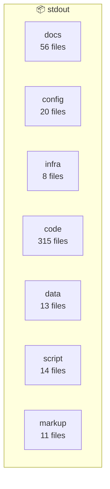
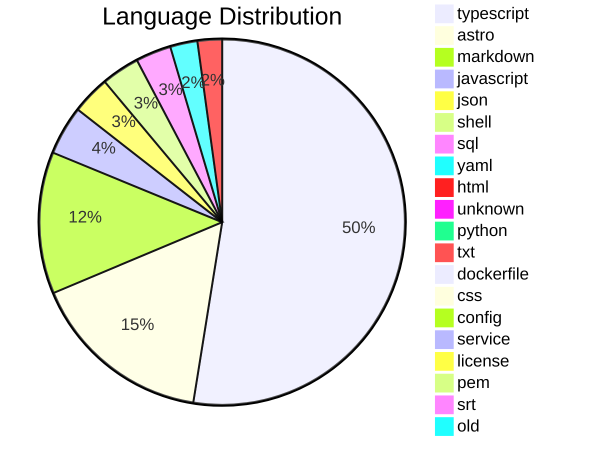

# Architecture Diagram: stdout

**Files:** 437 | **Complexity:** large

## Project Structure



## Languages



## File Tree

```
.DS_Store
.architecture/
  ARCHITECTURE.md
.architecture/
  SUMMARY.md
.architecture/
    api-response.json
.architecture/
    import-input.json
.architecture/
    import-map.json
.architecture/
    scan-files.json
.dockerignore
.env.example
.github/
  DOCKER_HUB_SETUP.md
.github/
  dependabot.yml
.github/
    docker-publish.yml
.github/
    release.yml
.lore/
  map.md
.mcp.json
.understand-anything/
    ua-scan-files.json
AUTOMATION_PLAN.md
BUILD.md
COMPLETE_AUTOMATION_SUMMARY.md
CRITICAL-FINDINGS.md
Dockerfile
astro.config.mjs
avahi-services/
  stdout.service
check-scanner-state.js
community-seed/
  01-cloudflare-tunnel-setup.md
community-seed/
  02-nginx-proxy-manager-new-service.md
community-seed/
  03-docker-healthcheck-patterns.md
community-seed/
  04-sqlite-backup-strategy.md
community-seed/
  05-authentik-oidc-integration.md
community-seed/
  06-telegraf-influxdb-grafana-monitoring.md
community-seed/
  07-postmortem-dns-propagation-outage.md
community-seed/
  08-postmortem-docker-compose-secrets.md
community-seed/
  09-n8n-workflow-backup-restore.md
community-seed/
  10-runbook-new-subdomain-end-to-end.md
comprehensive-e2e-test.js
demo-license.json
demo.license
deploy.example.yaml
docker-compose.observatory.yml
docker-compose.yml
docs/
  QA-Setup-Walkthrough-Report.md
docs/
  monitoring-installation.md
drizzle.config.ts
drizzle/
  0000_white_spyke.sql
drizzle/
  0001_fix_windlass_config.sql
drizzle/
  0002_add_fts_tables.sql
drizzle/
  0003_fix_ai_execution_audit.sql
drizzle/
  0004_add_entities.sql
drizzle/
  0005_add_entity_relationships.sql
drizzle/
  0006_add_discovered_hosts_columns.sql
```
